<div align="center">
<h1>muavin</h1>

A personal AI assistant that runs 24/7 on your Mac and talks to you via Telegram.

[](https://www.apple.com/macos/)
[](LICENSE)
[](https://bun.sh)
[](https://docs.anthropic.com/en/docs/claude-code)
[](https://telegram.org)

</div>

## ✨ Features

- **Claude Code brain** - spawns the Claude CLI for every request with full tool access (filesystem, shell, web, MCP servers)
- **Persistent memory** - stores conversations and auto-extracted facts in Supabase pgvector. Relevant context is injected into every conversation.
- **Thought dumps** - share thoughts, ideas, and notes without triggering analysis. Muavin acknowledges briefly and stores them for later.
- **Telegram interface** - text, photos, documents, group mentions. Chunked responses with Markdown.
- **Background agents** - kick off multiple agents in parallel for long-running tasks. Managed with concurrency limits, timeouts, and automatic result delivery.
- **Job system** - scheduled jobs with per-job launchd plists. Custom prompts or built-in actions.
- **Health monitoring** - heartbeat daemon checks all services and sends AI-triaged alerts via Telegram.

## 🏗 Architecture

```mermaid
flowchart TD
    You((("  You  "))) <-->|"  Telegram  "| Conductor["Conductor"]
    Heartbeat(["Heartbeat"]) -."  monitors  ".-> Conductor

    Conductor --- Agents["Agents<br/><sub>long-running background tasks</sub>"]
    Conductor --- Jobs["Jobs<br/><sub>run on a schedule</sub>"]
    Conductor --- Supabase[("Supabase<br/><sub>messages · memory</sub>")]

    style You fill:#f5f5f5,stroke:#999,color:#333
    style Conductor fill:#6366f1,stroke:#4f46e5,color:#fff
    style Agents fill:#f97316,stroke:#ea580c,color:#fff
    style Jobs fill:#f97316,stroke:#ea580c,color:#fff
    style Supabase fill:#22c55e,stroke:#16a34a,color:#fff
    style Heartbeat fill:#ef4444,stroke:#dc2626,color:#fff
```



> **Conductor** is the always-on orchestrator. It receives your Telegram messages, manages background agents, runs scheduled jobs, and stores everything in Supabase. **Heartbeat** monitors all services and alerts you if something goes down.

## 🚀 Quick Start

```bash
curl -fsSL https://raw.githubusercontent.com/daydemir/muavin/main/install.sh | bash
muavin setup
```

<details>
<summary><strong>Prerequisites</strong></summary>

- macOS (Apple Silicon or Intel)
- [Bun](https://bun.sh) runtime
- [Claude Code CLI](https://docs.anthropic.com/en/docs/claude-code) (`npm install -g @anthropic-ai/claude-code`)
- Telegram bot token (from [@BotFather](https://t.me/BotFather))
- [Supabase](https://supabase.com) project (free tier works)
- [OpenAI API key](https://platform.openai.com/api-keys) (for embeddings)

</details>

<details>
<summary><strong>Manual Installation</strong></summary>

```bash
git clone https://github.com/daydemir/muavin.git ~/.muavin/src
cd ~/.muavin/src
bun install
bun muavin setup
```

</details>

## 💻 Usage

```bash
bun muavin setup     # Interactive setup wizard
bun muavin start     # Deploy launchd daemons
bun muavin stop      # Stop all daemons
bun muavin status    # Check daemon and session status
bun muavin config    # Edit configuration (TUI)
bun muavin test      # Run smoke tests
```

<details>
<summary><strong>⚙️ Configuration</strong></summary>

`~/.muavin/config.json`:

| Key | Description | Default |
|-----|-------------|---------|
| `owner` | Your Telegram user ID | - |
| `allowUsers` | Allowed Telegram user IDs | `[]` |
| `allowGroups` | Allowed Telegram group IDs | `[]` |
| `model` | Claude model (`sonnet`, `opus`, `haiku`) | `sonnet` |
| `claudeTimeoutMs` | Max time per Claude call (ms) | `43200000` |
| `maxTurns` | Max agentic turns per Claude CLI call | `100` |
| `agentTimeoutMs` | Timeout for background agents (ms) | `600000` |
| `recentMessageCount` | Recent messages fetched from Supabase for context | `10` |
| `startOnLogin` | Auto-start daemons on macOS login | `true` |

`~/.muavin/.env`:

| Key | Required | Description |
|-----|----------|-------------|
| `TELEGRAM_BOT_TOKEN` | Yes | From @BotFather |
| `SUPABASE_URL` | Yes | Project URL |
| `SUPABASE_SERVICE_KEY` | Yes | Service role key |
| `OPENAI_API_KEY` | Yes | For embeddings |
| `ANTHROPIC_API_KEY` | No | For Claude Code CLI (if not already set) |
| `XAI_API_KEY` | No | Grok access |
| `GEMINI_API_KEY` | No | Gemini access |
| `OPENROUTER_API_KEY` | No | OpenRouter access |
| `BRAVE_API_KEY` | No | Brave Search |

</details>

## 🙏 Credits

- [Claude Code](https://docs.anthropic.com/en/docs/claude-code) by Anthropic
- [Grammy](https://grammy.dev) - Telegram bot framework
- [Supabase](https://supabase.com) - pgvector for memory
- [Croner](https://github.com/hexagon/croner) - cron expression parsing (for status display)
- Inspired by [OpenClaw](https://github.com/openclaw/openclaw), [godagoo/claude-telegram-relay](https://github.com/godagoo/claude-telegram-relay), and [HKUDS/nanobot](https://github.com/HKUDS/nanobot)

## License

MIT
