<div align="center">
<h1>muavin</h1>

A personal AI assistant that improves itself every day.

[](https://www.apple.com/macos/)
[](LICENSE)
[](https://bun.sh)
[](https://docs.anthropic.com/en/docs/claude-code)
[](https://telegram.org)

</div>

> [!WARNING]
> **This is experimental, early-stage software.** Muavin uses Claude Code under the hood. It can execute arbitrary shell commands, read and write files anywhere on your filesystem, and make network requests. It also consumes significant Claude Code API tokens, especially with background jobs and agents running daily. Use at your own risk.

Muavin runs on your Mac and talks to you via Telegram. It stores conversations and facts in Supabase, so your memory is always backed up and portable. Every day it reviews its own logs, fixes what it can, and suggests ways it can help.

## What makes this different

### It reviews its own work

Three default jobs run daily:

- **Self-review** reviews recent conversations, logs, and memories for mistakes or stale information and attempts to fix what it can.
- **Autonomous suggestions** proposes actions it could take on your behalf, based on what it knows about you.
- **User suggestions** proposes high-value actions for you to consider.

Each job sees how you responded to past suggestions and factors that into future ones.

### Skills are learned, not pre-built

Muavin ships with no built-in skills. You teach it through conversation. Say "learn how to check flight prices" and it researches the approach, tests it, and saves a reusable skill file. Skills are markdown files in `~/.muavin/skills/` that you can inspect and edit.

### Your memory is portable

Conversations and extracted facts live in Supabase with pgvector embeddings. Switch computers and nothing is lost. A pipeline extracts facts from your conversations every 2 hours. A daily audit cleans up duplicates, contradictions, and stale entries.

## How it works

```mermaid
flowchart TD
    You((("  You  "))) <-->|"  Telegram  "| Conductor["Conductor"]
    Heartbeat(["Heartbeat"]) -."  monitors  ".-> Conductor

    Conductor --- Agents["Agents<br/><sub>long-running background tasks</sub>"]
    Conductor --- Jobs["Jobs<br/><sub>run on a schedule</sub>"]
    Conductor --- Supabase[("Supabase<br/><sub>messages · memory</sub>")]

    style You fill:#f5f5f5,stroke:#999,color:#333
    style Conductor fill:#6366f1,stroke:#4f46e5,color:#fff
    style Agents fill:#f97316,stroke:#ea580c,color:#fff
    style Jobs fill:#f97316,stroke:#ea580c,color:#fff
    style Supabase fill:#22c55e,stroke:#16a34a,color:#fff
    style Heartbeat fill:#ef4444,stroke:#dc2626,color:#fff
```



**Conductor** is the always-on relay. It receives your Telegram messages, manages background agents, runs scheduled jobs, and stores everything in Supabase. **Heartbeat** monitors all services and alerts you if something goes down.

**Jobs** run on a schedule (cron expressions, each gets its own launchd plist). **Agents** run in the background for longer tasks. Results flow through an outbox. The relay decides what to deliver to you and what to skip.

## Quick start

```bash
curl -fsSL https://raw.githubusercontent.com/daydemir/muavin/main/install.sh | bash
muavin setup
```

<details>
<summary><strong>Prerequisites</strong></summary>

- macOS (Apple Silicon or Intel)
- [Bun](https://bun.sh) runtime
- [Claude Code CLI](https://docs.anthropic.com/en/docs/claude-code) (`npm install -g @anthropic-ai/claude-code`)
- Telegram bot token (from [@BotFather](https://t.me/BotFather))
- [Supabase](https://supabase.com) project (free tier works)
- [OpenAI API key](https://platform.openai.com/api-keys) (for embeddings)

</details>

<details>
<summary><strong>Manual installation</strong></summary>

```bash
git clone https://github.com/daydemir/muavin.git ~/.muavin/src
cd ~/.muavin/src
bun install
bun muavin setup
```

</details>

## Usage

```bash
bun muavin setup     # Interactive setup wizard
bun muavin start     # Deploy launchd daemons
bun muavin stop      # Stop all daemons
bun muavin status    # Check daemon and session status
bun muavin config    # Edit configuration (TUI)
bun muavin test      # Run smoke tests
```

<details>
<summary><strong>Configuration</strong></summary>

`~/.muavin/config.json`:

| Key | Description | Default |
|-----|-------------|---------|
| `owner` | Your Telegram user ID | - |
| `allowUsers` | Allowed Telegram user IDs | `[]` |
| `allowGroups` | Allowed Telegram group IDs | `[]` |
| `model` | Claude model (`sonnet`, `opus`, `haiku`) | `sonnet` |
| `claudeTimeoutMs` | Max time per Claude call (ms) | `43200000` |
| `maxTurns` | Max agentic turns per Claude CLI call | `100` |
| `agentTimeoutMs` | Timeout for background agents (ms) | `600000` |
| `recentMessageCount` | Recent messages fetched from Supabase for context | `10` |
| `startOnLogin` | Auto-start daemons on macOS login | `true` |

`~/.muavin/.env`:

| Key | Required | Description |
|-----|----------|-------------|
| `TELEGRAM_BOT_TOKEN` | Yes | From @BotFather |
| `SUPABASE_URL` | Yes | Project URL |
| `SUPABASE_SERVICE_KEY` | Yes | Service role key |
| `OPENAI_API_KEY` | Yes | For embeddings |
| `ANTHROPIC_API_KEY` | No | For Claude Code CLI (if not already set) |
| `XAI_API_KEY` | No | Grok access |
| `GEMINI_API_KEY` | No | Gemini access |
| `OPENROUTER_API_KEY` | No | OpenRouter access |
| `BRAVE_API_KEY` | No | Brave Search |

</details>

## Credits

- [Claude Code](https://docs.anthropic.com/en/docs/claude-code) by Anthropic
- [Grammy](https://grammy.dev) - Telegram bot framework
- [Supabase](https://supabase.com) - pgvector for memory
- [Croner](https://github.com/hexagon/croner) - cron expression parsing (for status display)
- Inspired by [OpenClaw](https://github.com/openclaw/openclaw), [godagoo/claude-telegram-relay](https://github.com/godagoo/claude-telegram-relay), and [HKUDS/nanobot](https://github.com/HKUDS/nanobot)

## License

MIT
